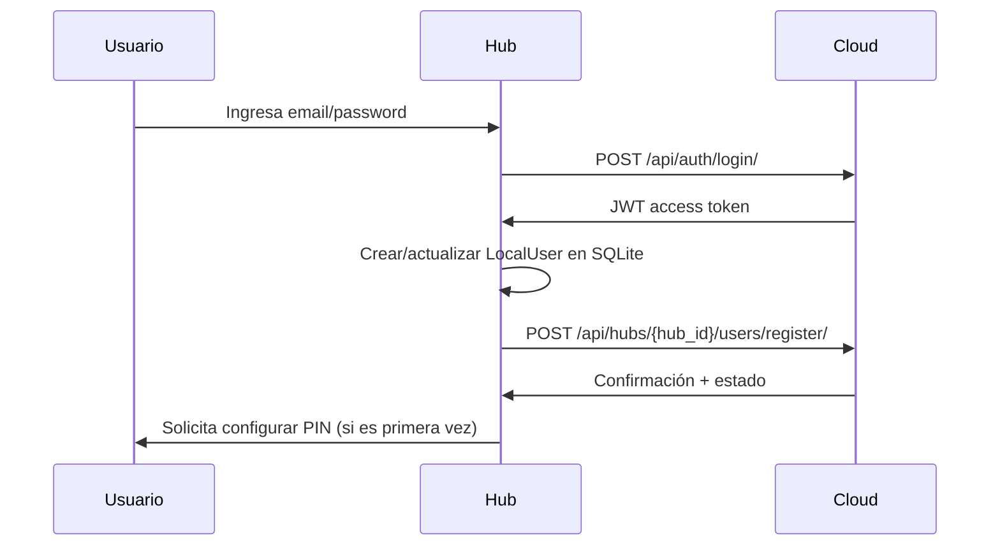
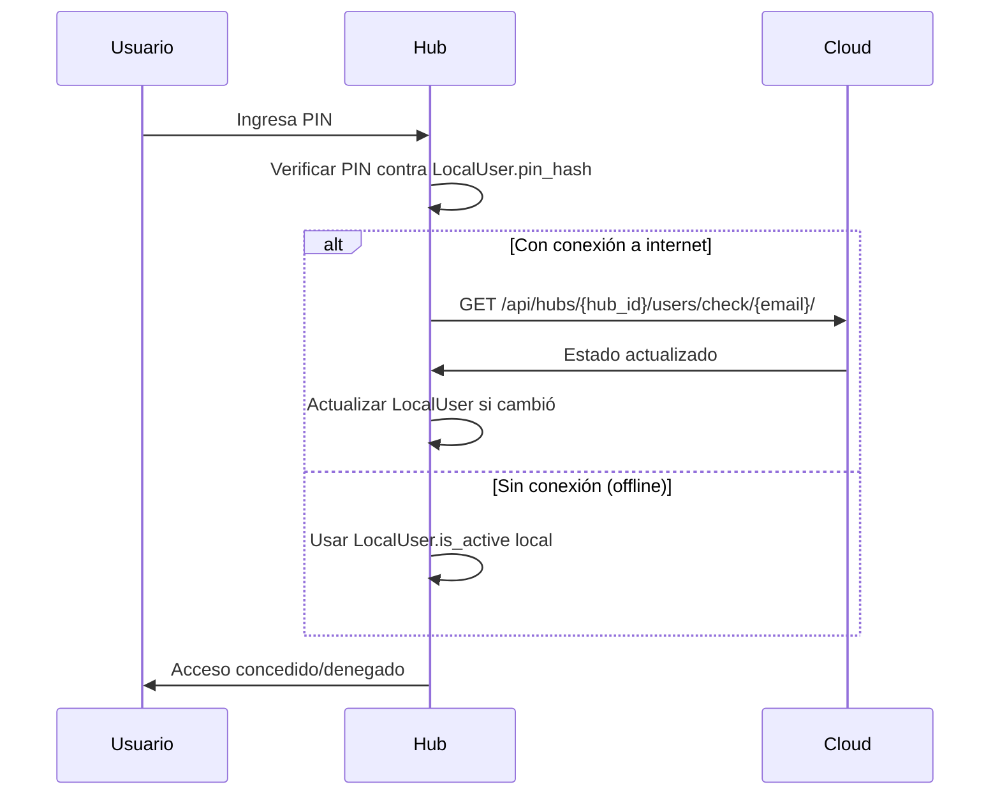

# Comunicación Hub → Cloud

Documentación de cómo el Hub se comunica con el Cloud Portal.

---

## 🎯 Resumen

El Hub se comunica con Cloud mediante **HTTP REST API**:

| Método | Uso | Autenticación |
|--------|-----|---------------|
| **REST API** | Registro, sincronización, verificación de usuarios | JWT (login) o `cloud_api_token` (Hub) |

El core del Hub usa HTTP REST API para todas las comunicaciones.

---

## 📡 API REST Endpoints

### 1. Login (obtener JWT del owner)

```http
POST https://erplora.com/api/auth/login/
Content-Type: application/json

{
  "email": "owner@example.com",
  "password": "password123"
}
```

**Response:**
```json
{
  "access": "eyJ0eXAiOiJKV1QiLCJhbGc...",
  "refresh": "eyJ0eXAiOiJKV1QiLCJhbGc...",
  "user": {
    "id": "uuid",
    "email": "owner@example.com"
  }
}
```

**Uso:**
- Durante configuración inicial del Hub
- Cuando un usuario hace Cloud Login (email + password)
- **NO se guarda** el JWT permanentemente (es temporal)

---

### 2. Auto-registro del Hub

```http
POST https://erplora.com/api/hubs/register/
Authorization: Bearer {jwt_access_token_del_owner}
Content-Type: application/json

{
  "name": "Tienda Principal",
  "address": "Calle 123, Ciudad"
}
```

**Response:**
```json
{
  "hub_id": "550e8400-e29b-41d4-a716-446655440000",
  "slug": "tienda-principal-abc123",
  "cloud_api_token": "secret_permanent_token_xyz123"
}
```

**Uso:**
- Solo la primera vez que Hub se configura
- Hub usa JWT del owner para autenticarse
- Cloud genera `cloud_api_token` permanente para el Hub
- Hub guarda en `HubConfig`: `hub_id`, `cloud_api_token`

---

### 3. Registrar Usuario en Hub

Llamado cuando un usuario hace Cloud Login desde el Hub.

```http
POST https://erplora.com/api/hubs/{hub_id}/users/register/
Authorization: Bearer {jwt_access_token}
Content-Type: application/json

{
  "user_email": "user@example.com",
  "metadata": {"device": "Darwin", "hub_version": "1.0.0"}
}
```

**Response:**
```json
{
  "success": true,
  "user_id": "uuid",
  "is_active": true,
  "is_owner": false,
  "role": "cashier"
}
```

---

### 4. Verificar Acceso de Usuario

Llamado durante login con PIN para verificar que el usuario sigue activo.

```http
GET https://erplora.com/api/hubs/{hub_id}/users/check/{email}/
X-Hub-Token: {cloud_api_token}
```

**Response:**
```json
{
  "has_access": true,
  "is_active": true,
  "is_owner": false,
  "reason": null
}
```

---

### 5. Remover Usuario del Hub

```http
DELETE https://erplora.com/api/hubs/{hub_id}/users/{email}/
X-Hub-Token: {cloud_api_token}
```

**Response:**
```json
{
  "success": true,
  "message": "User access revoked"
}
```

---

### 6. Obtener clave pública RSA

```http
GET https://erplora.com/api/auth/public-key/
```

**Response:**
```json
{
  "public_key": "-----BEGIN PUBLIC KEY-----\nMIICIjANBgkq...",
  "algorithm": "RS256"
}
```

**Uso:**
- Hub descarga clave pública del Cloud
- Usa la clave para validar tokens JWT localmente
- Se cachea localmente

---

## 🔄 Sistema de Sincronización (Sync-on-Access)

**Estrategia:** Verificación y sincronización **on-demand** durante login, NO proactiva.

### Flujo 1: Cloud Login desde Hub



### Flujo 2: Login con PIN (Offline/Online)



### Ventajas del Sistema Sync-on-Access

- ✅ **Verificación on-demand** - solo verifica cuando el usuario hace login
- ✅ **Sin cola de sincronización compleja** - verificación puntual
- ✅ **Resiliente** - fallback a estado local si Cloud no disponible temporalmente

---

## 🔐 Seguridad

### Credenciales del Hub

| Credencial | Descripción | Almacenamiento |
|------------|-------------|----------------|
| `hub_id` | UUID único del Hub | SQLite (HubConfig) |
| `cloud_api_token` | Token permanente para HTTP API | SQLite (HubConfig) |

### Tokens JWT de Usuario

- **Solo para login**: Usuario ingresa credenciales
- **No se guardan**: JWT es temporal y se descarta
- **Corta duración**: Access token expira en 1 hora

### Comunicación Segura

- **HTTPS**: Todas las API calls usan HTTPS
- **Headers de autenticación**: `Authorization: Bearer` o `X-Hub-Token`

---

## 🐛 Troubleshooting

### Hub no puede registrarse

```python
# Verificar conectividad
import requests
from apps.configuration.models import HubConfig

config = HubConfig.get_solo()
response = requests.get(f"{config.cloud_url}/api/auth/public-key/")
print(response.status_code)  # Debe ser 200
```

### Usuario no puede hacer login

1. Verificar que el usuario existe en Cloud
2. Verificar que tiene acceso al Hub (HubUser.is_active)
3. Revisar logs del Hub para ver errores de API

### Sincronización no funciona

1. Verificar conexión a internet
2. Verificar que `cloud_api_token` es válido
3. Revisar respuesta del endpoint de verificación

---

**Ultima actualizacion**: 2025-12-09
