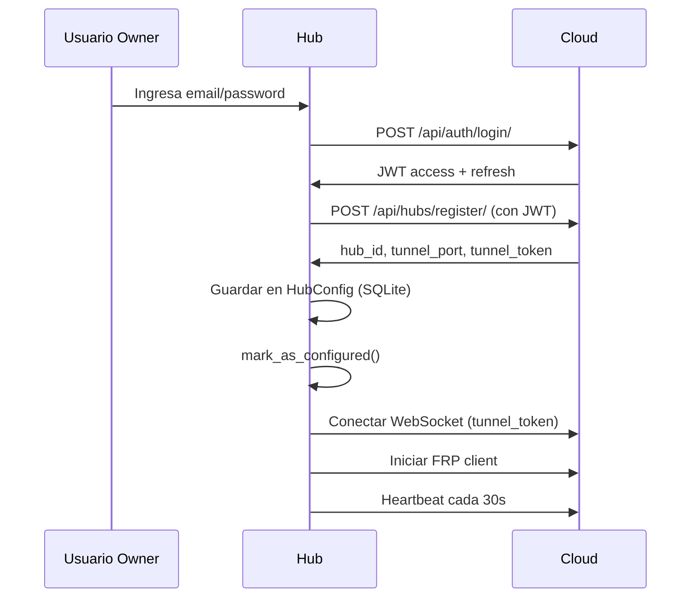
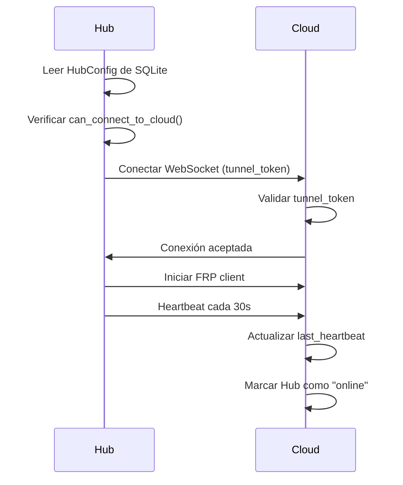

# Comunicación Hub → Cloud

Documentación completa de cómo el Hub se comunica con el Cloud.

---

## 🎯 Resumen

El Hub se comunica con Cloud mediante:
1. **API REST** - Para auto-registro y sincronización de datos
2. **WebSocket** - Para heartbeat y comunicación real-time
3. **FRP Tunnel** - Para acceso remoto desde Cloud al Hub

---

## 📡 API REST Endpoints

### 1. Login (obtener JWT del owner)

```http
POST https://erplora.com/api/auth/login/
Content-Type: application/json

{
  "email": "owner@example.com",
  "password": "password123"
}
```

**Response:**
```json
{
  "access": "eyJ0eXAiOiJKV1QiLCJhbGc...",
  "refresh": "eyJ0eXAiOiJKV1QiLCJhbGc...",
  "user": {
    "id": "uuid",
    "email": "owner@example.com"
  }
}
```

**Uso:**
- Solo durante configuración inicial del Hub
- El owner ingresa credenciales en wizard
- Hub obtiene JWT temporal para registrarse
- **NO se guarda** el JWT (es temporal)

---

### 2. Auto-registro del Hub

```http
POST https://erplora.com/api/hubs/register/
Authorization: Bearer {jwt_access_token_del_owner}
Content-Type: application/json

{
  "name": "Tienda Principal",
  "address": "Calle 123, Ciudad"
}
```

**Response:**
```json
{
  "hub_id": "550e8400-e29b-41d4-a716-446655440000",
  "slug": "tienda-principal-abc123",
  "tunnel_port": 7001,
  "tunnel_token": "secret_permanent_token_xyz123"
}
```

**Uso:**
- Solo la primera vez que Hub se configura
- Hub usa JWT del owner para autenticarse
- Cloud asigna puerto FRP único y genera `tunnel_token`
- Hub guarda en `HubConfig`: `hub_id`, `tunnel_port`, `tunnel_token`

**Implementación en Hub:**
```python
from apps.core.models import HubConfig
import requests

def register_hub(owner_jwt, hub_name):
    """Auto-registro del Hub en Cloud"""

    config = HubConfig.get_config()

    # Request a Cloud
    response = requests.post(
        f"{config.cloud_url}/api/hubs/register/",
        headers={"Authorization": f"Bearer {owner_jwt}"},
        json={"name": hub_name}
    )

    data = response.json()

    # Guardar credenciales permanentes del Hub
    config.hub_id = data['hub_id']
    config.tunnel_port = data['tunnel_port']
    config.tunnel_token = data['tunnel_token']
    config.mark_as_configured()

    return config
```

---

### 3. Refresh Token (si fuera necesario)

```http
POST https://erplora.com/api/auth/refresh/
Content-Type: application/json

{
  "refresh": "eyJ0eXAiOiJKV1QiLCJhbGc..."
}
```

**Response:**
```json
{
  "access": "eyJ0eXAiOiJKV1QiLCJhbGc...",
  "refresh": "eyJ0eXAiOiJKV1QiLCJhbGc..."
}
```

**Uso:**
- Generalmente NO se usa en el Hub
- Los tokens JWT del owner son temporales y solo para registro
- Hub usa `tunnel_token` para comunicación permanente

---

### 4. Obtener clave pública RSA

```http
GET https://erplora.com/api/auth/public-key/
```

**Response:**
```json
{
  "public_key": "-----BEGIN PUBLIC KEY-----\nMIICIjANBgkq...",
  "algorithm": "RS256"
}
```

**Uso:**
- Hub descarga clave pública del Cloud
- Usa la clave para validar tokens JWT localmente (si fuera necesario)
- Se puede cachear localmente

---

## 🔌 WebSocket Connection

### Conexión al Cloud

```
wss://erplora.com/ws/hub/{hub_id}/?token={tunnel_token}
```

**Parámetros:**
- `{hub_id}` - UUID del Hub (obtenido en registro)
- `{tunnel_token}` - Token permanente del Hub (obtenido en registro)

**Autenticación:**
- Hub usa `tunnel_token` en query string
- Cloud valida token en handshake
- **NO usa JWT de usuario** - usa credencial del Hub

**Implementación en Hub:**
```python
import asyncio
import websockets
import json
from apps.core.models import HubConfig

async def connect_to_cloud():
    """Conectar al Cloud vía WebSocket"""

    config = HubConfig.get_config()

    if not config.can_connect_to_cloud():
        print("Hub not configured yet")
        return

    uri = f"wss://{config.cloud_url.replace('https://', '')}/ws/hub/{config.hub_id}/?token={config.tunnel_token}"

    async with websockets.connect(uri) as websocket:
        # Iniciar heartbeat
        await start_heartbeat(websocket)

        # Escuchar mensajes del Cloud
        async for message in websocket:
            await handle_message(json.loads(message))
```

---

### Mensajes Hub → Cloud

#### 1. Heartbeat (cada 30 segundos)

```json
{
  "type": "heartbeat",
  "timestamp": "2025-01-28T10:30:00Z"
}
```

**Propósito:**
- Mantener la conexión activa
- Cloud actualiza `hub.last_heartbeat`
- Si heartbeat > 5 minutos → Hub se marca offline

**Implementación:**
```python
async def send_heartbeat(websocket):
    """Enviar heartbeat al Cloud"""
    from datetime import datetime, UTC

    while True:
        await websocket.send(json.dumps({
            "type": "heartbeat",
            "timestamp": datetime.now(UTC).isoformat()
        }))
        await asyncio.sleep(30)  # cada 30 segundos
```

#### 2. Sincronización de usuarios

```json
{
  "type": "user_sync",
  "users": [
    {
      "cloud_user_id": "uuid",
      "email": "cajero@example.com",
      "last_activity": "2025-01-28T10:00:00Z"
    }
  ]
}
```

**Propósito:**
- Informar al Cloud qué usuarios están activos en el Hub
- Cloud puede sincronizar permisos

#### 3. Plugin instalado

```json
{
  "type": "plugin_installed",
  "plugin_id": "uuid",
  "version": "1.0.0",
  "installed_at": "2025-01-28T09:00:00Z"
}
```

**Propósito:**
- Notificar al Cloud que se instaló un plugin
- Cloud actualiza registro de instalaciones para billing

---

### Mensajes Cloud → Hub

#### 1. Actualización de plugin disponible

```json
{
  "type": "plugin_update_available",
  "plugin_id": "uuid",
  "current_version": "1.0.0",
  "new_version": "1.1.0",
  "download_url": "https://erplora.com/api/plugins/uuid/download/"
}
```

**Acción del Hub:**
- Mostrar notificación al usuario
- Permitir actualizar plugin desde UI

#### 2. Usuario revocado

```json
{
  "type": "user_revoked",
  "user_id": "uuid",
  "email": "cajero@example.com",
  "reason": "Acceso revocado por administrador"
}
```

**Acción del Hub:**
- Cerrar sesión del usuario si está activo
- Deshabilitar acceso futuro
- Sincronizar lista de usuarios permitidos

#### 3. Solicitud de backup

```json
{
  "type": "backup_request",
  "requested_by": "admin@example.com"
}
```

**Acción del Hub:**
- Crear backup de SQLite
- Comprimir y cifrar
- Subir a Cloud vía API

---

## 🚇 FRP Tunnel

### Cliente FRP en el Hub

**Propósito:**
- Permitir acceso remoto desde Cloud al Hub local
- Usuario en portal web puede acceder a `hub-{slug}.erplora.com`
- Traefik proxy en Cloud redirige a puerto FRP → Hub local

**Configuración FRP (generada por Cloud):**

```toml
# config/frpc.toml
[common]
server_addr = erplora.com
server_port = 7000
token = {tunnel_token}

[hub-{hub_id}]
type = tcp
local_ip = 127.0.0.1
local_port = 8001
remote_port = {tunnel_port}
```

**Inicio del cliente FRP:**
```python
import subprocess
from apps.core.models import HubConfig

def start_frp_client():
    """Iniciar cliente FRP"""

    config = HubConfig.get_config()

    if not config.has_tunnel_credentials():
        return

    # Ejecutar binario frpc
    subprocess.Popen([
        './bin/frpc',
        '-c', 'config/frpc.toml'
    ])
```

---

## 🔄 Flujo Completo de Comunicación

### Configuración Inicial (primera vez)



### Arranque Normal (después de configurado)



---

## 🔐 Seguridad

### Credenciales del Hub

- **tunnel_token**: Credencial permanente del Hub (como una "contraseña" del Hub)
- **tunnel_port**: Puerto único asignado (7001-7100)
- **hub_id**: Identificador único del Hub

### Tokens JWT del Owner

- **Solo para registro inicial**: Owner ingresa credenciales una vez
- **No se guardan**: JWT es temporal y se descarta después del registro
- **No se usan para arranque**: Hub usa `tunnel_token` después de configurado

### Comunicación Segura

- **HTTPS**: Todas las API calls usan HTTPS
- **WSS**: WebSocket usa conexión segura (wss://)
- **FRP con token**: Túnel autenticado con `tunnel_token`

---

## 📝 Checklist de Implementación

### En el Hub (TODO)

- [ ] Implementar `RegistrationService` para auto-registro
- [ ] Implementar `WebSocketClient` para heartbeat
- [ ] Implementar `FRPClient` para túnel
- [ ] Crear wizard de configuración inicial (UI)
- [ ] Manejar reconexión automática si falla WebSocket
- [ ] Implementar handlers para mensajes de Cloud

### APIs de Cloud necesarias

- [x] `POST /api/auth/login/` ✅
- [x] `POST /api/auth/refresh/` ✅
- [x] `GET /api/auth/public-key/` ✅
- [ ] `POST /api/hubs/register/` (TODO)
- [ ] WebSocket endpoint `wss://.../ws/hub/{hub_id}/` (TODO)
- [ ] FRP server configurado (TODO)

---

## 🐛 Troubleshooting

### Hub no puede registrarse

```python
# Verificar conectividad
import requests
config = HubConfig.get_config()
response = requests.get(f"{config.cloud_url}/api/auth/public-key/")
print(response.status_code)  # Debe ser 200
```

### WebSocket se desconecta

- Verificar que `tunnel_token` sea válido
- Verificar que Hub tenga conexión a internet
- Revisar logs del Cloud para ver errores de autenticación
- Implementar reconexión automática con backoff exponencial

### FRP no conecta

- Verificar que puerto `tunnel_port` sea correcto
- Verificar que servidor FRP esté corriendo en Cloud
- Verificar que `tunnel_token` sea válido
- Revisar logs de FRP: `./bin/frpc -c config/frpc.toml`

---

**Última actualización**: 2025-01-28
